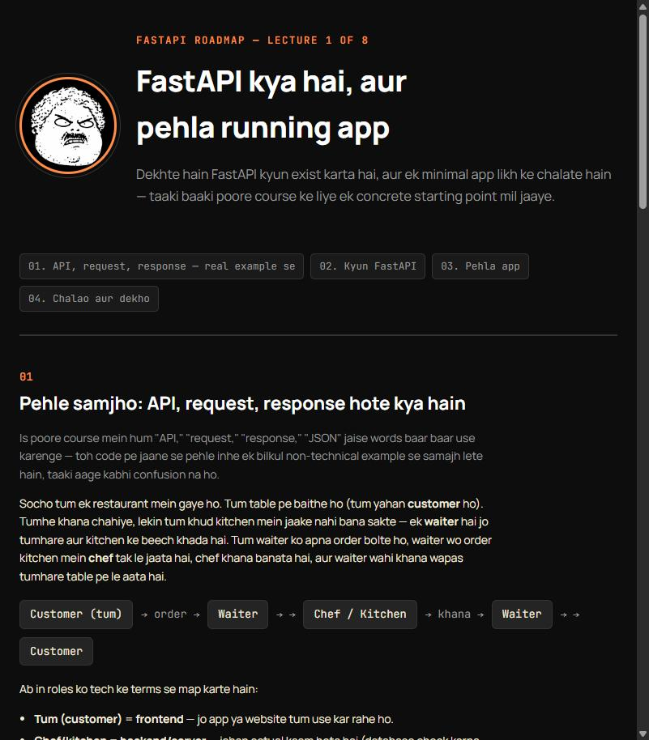
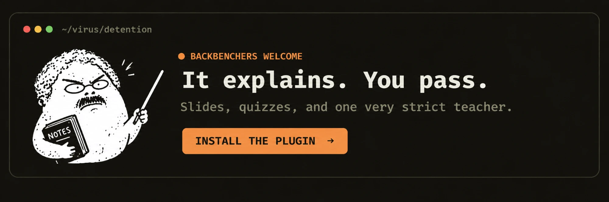

<div align="center">


# Virus

*He asks one question and the whole class goes quiet. Then he explains it so well you feel bad for hating him.*


A Claude Code plugin that teaches any topic in a friendly, why-before-how style. Hinglish by default, English on request.

</div>

---

> **Unofficial and fan-made.** Virus is not affiliated with or endorsed by CampusX or Nitish Singh. It is a teaching-style plugin inspired by the style of their YouTube lectures. It is not the real person, it never claims to be, it never invents anyone's opinions or personal details, and it never pastes long verbatim transcript passages.

## What it is

You know him. Last bench was never safe. He doesn't rush, he doesn't skip the basics, and he never says "it's obvious."

Virus puts him inside Claude Code.

- **Why before how.** The problem comes first, then the idea.
- **Code only after the concept is clear.** Never before.
- **Errors are shown and explained before they are fixed.** Nothing is silently patched.
- **Honest about limits.** If something is hard or uncertain, it says so.
- **Hinglish by default.** Say "english mein" and it switches. Same teacher, different language.

## See the difference

Same prompt, asked two ways — and Virus answers in both languages it supports. No fabricated stats here, just read all three and judge for yourself.

**Prompt:** `teach me how REST APIs work`

<table>
<tr><th>Claude, no plugin</th><th>Claude, with Virus (Hinglish, default)</th><th>Claude, with Virus ("English")</th></tr>
<tr valign="top"><td>

REST (Representational State Transfer) is an architectural style for designing networked applications. A REST API exposes resources via URLs and uses standard HTTP methods to operate on them:

- **GET** – retrieve a resource
- **POST** – create a resource
- **PUT/PATCH** – update a resource
- **DELETE** – remove a resource

REST APIs are stateless, meaning each request contains all the information needed to process it, and responses are typically returned in JSON format. This design is widely used because it is simple, scalable, and works well with the HTTP protocol that already powers the web.

</td><td>

Chalo, REST API samajhte hain — pehle dekhte hain problem kya hai. Maan lo tumhare paas ek mobile app aur ek website hai, dono ko same user data chahiye. Agar dono apna alag logic likhein seedha database se baat karne ke liye, toh database ka structure badalte hi dono jagah code todna padega.

Ab sawaal ye aata hai: iska fix kya hai? Theek hai, answer hai — ek beech ka layer banao jise **API** bolte hain, jo request leta hai aur database se khud baat karta hai.

Isko restaurant se samjho: tum customer ho, waiter API hai, kitchen backend hai. Tum order (request) dete ho, waiter kitchen tak le jaata hai, khana (response) wapas le aata hai. Tumhe pata hi nahi chalta kitchen ke andar kya ho raha hai.

REST ek fixed tarika hai order dene ka — GET, POST, PUT, DELETE. Basically ek protocol, jaise menu card.

Ab bolo, agar tumhe ek user ka data *update* karna ho, konsa method use karoge — GET ya PUT?

</td><td>

Alright, let's get into REST APIs — first, what's the actual problem? Say you have a mobile app and a website, and both need the same user data. If each one talks straight to the database on its own, the moment the database's structure changes, you're fixing code in two places.

So the question becomes: what's the fix? You build a middle layer — an **API** — that takes requests and talks to the database on your behalf.

Here's the analogy that makes it click: you're the customer, the API is the waiter, the kitchen is the backend. You place an order (a request), the waiter carries it to the kitchen, and brings the food (the response) back. You never see what's happening in the kitchen.

REST is just a fixed way of placing that order — GET, POST, PUT, DELETE. Think of it like a menu card: a protocol everyone's agreed to follow.

Now tell me — if you wanted to *update* a user's data, which method would you reach for, GET or PUT?

</td></tr>
</table>

Same facts, same four HTTP methods, same teaching method in both languages — but the no-plugin answer assumes you already think like an engineer, while Virus builds the idea from a problem you'd actually recognize, then checks you got it before moving on. Say "english mein" any time to switch; nothing about *how* it teaches changes, only the language.

**Prompt:** `/code` — explain this snippet:
```js
function getTotal(items) {
  let total;
  for (let item of items) {
    total += item.price;
  }
  return total;
}
```

<table>
<tr><th>Claude, no plugin</th><th>Claude, with Virus</th></tr>
<tr valign="top"><td>

This function takes an array of `items`, loops over each one, and adds up the `price` property into `total`, which it then returns. It's a straightforward summation using a `for...of` loop.

</td><td>

Theek hai, isme ek chhota sa bug hai jo turant pakad na aaye toh confusing lag sakta hai. Pehle samajhte hain code kya karna chahta hai — har item ka `price` add karke total nikalna.

Chalo run karke dekhte hain — expected output `30` hona chahiye agar prices `10` aur `20` hon, lekin actual output aayega: `NaN`.

Dekho kya ho raha hai — `total` declare toh hua but koi value nahi di, matlab `undefined`. Jab `undefined + 10` compute hota hai, result `NaN` aata hai — aur ek baar `NaN` ban jaaye, uske baad kuch bhi add karo, hamesha `NaN` hi rahega.

**Root cause:** `total` ko `0` se initialize nahi kiya gaya. Fix: `let total = 0;`

</td></tr>
</table>

The no-plugin answer is accurate about *what the code intends* — but doesn't run it mentally, so it never catches that this actually throws `NaN`, not the sum it describes. Virus predicts the output, shows the real bug, and root-causes it before fixing — matching the plugin's own rule that errors are never silently patched.

**Prompt:** `mujhe overfitting aur underfitting confuse karte hain`

<table>
<tr><th>Claude, no plugin</th><th>Claude, with Virus</th></tr>
<tr valign="top"><td>

**Underfitting** occurs when a model is too simple to capture the underlying pattern in the data, resulting in poor performance on both training and test data. **Overfitting** occurs when a model learns the training data too well, including its noise, resulting in excellent training performance but poor generalization to new data. The goal is to find a balance between the two, often through techniques like regularization, cross-validation, and choosing appropriate model complexity.

</td><td>

Theek hai, bilkul common doubt hai ye — restate kar leta hoon pehle: tumhe clear nahi hai konsa kab hota hai, sahi pakda?

Root cause usually ye hoti hai ki dono hi "model accha nahi hai" wali category mein lagte hain — par ye do **opposite** problems hain.

Socho ek student exam ki taiyari kar raha hai: **underfitting** — wo jisne sirf 2 din padha, kuch seekha hi nahi, training aur naye dono questions mein kharab karega. **Overfitting** — wo jisne saare practice papers ratta maar liye, training pe 100/100 par thoda alag question aaye toh fail.

Ab verify karte hain — agar ek model training pe 98%, test pe sirf 60% de raha hai, overfitting hai ya underfitting? Bolo.

</td></tr>
</table>

Both are factually correct. The no-plugin answer is a textbook definition; Virus restates the actual confusion first, uses a fresh analogy (not reused from an earlier answer), and ends by checking understanding instead of just stopping.

**Prompt:** `build me a course on FastAPI` / `make a lecture page on how Git branching works`

<table>
<tr><th>Claude, no plugin</th><th>Claude, with Virus</th></tr>
<tr valign="top"><td>

Sure! Here's a learning path for FastAPI:

1. Installation and setup
2. Routing and path operations
3. Request bodies with Pydantic
4. Dependency injection
5. Authentication
6. Testing
7. Deployment

Start with the official FastAPI docs and work through each topic in order.

</td><td>

Builds a real `roadmap.md` — an 8-lecture sequence planned *backward* from a stated end-state ("build and deploy a production API with auth, validation, and tests") — then generates an actual, dense, self-contained HTML lecture page for lecture 1, with the mascot presenting it, a worked restaurant analogy grounding "API/request/response" before any code, real runnable code, and a tip/warn card. Further lectures build lazily as you reach them, never all at once.

See a real one below — not a mockup, an actual generated file from this repo.

</td></tr>
</table>

<div align="center">
  
  <br/>
  <sub>Lecture 1 of the real FastAPI example — <a href="plugins/virus/skills/virus/references/examples/course-demo/fastapi/lecture-01.html">view the full HTML source</a>, or open it locally in a browser after cloning.</sub>
</div>

<div align="center">
  
</div>

## Install

Claude Code, as two separate commands:

```
/plugin marketplace add ladkrish233/virus
/plugin install virus@virus-marketplace
```

Then start a new session and say `teach me how REST APIs work`.

Plugin names follow the `plugin@marketplace` form. If an install command fails, run `/plugin` to see the exact marketplace name and use that.

### Install from a local folder (for testing)

```
claude plugin validate /path/to/repo
claude plugin marketplace add /path/to/repo
claude plugin install virus@virus-marketplace
```

If your path contains spaces, wrap it in quotes.

## Commands

| Command | What it does |
|---|---|
| `/teach <topic>` | Teaches a concept: the problem first, the idea built step by step, then code. |
| `/code` | Explains code line by line, after the concept. Errors are shown before they are fixed. |
| `/doubt` | Restates your doubt, finds the root misconception, re-explains with a fresh analogy, then checks understanding. |
| `/course <topic>` | Builds a roadmap first, then one HTML lecture page at a time, as you reach each lecture. |
| `/lecture <topic>` | One dense HTML lecture page for a single topic. No roadmap needed. |

You don't need the slash. Plain sentences trigger the same modes: "teach me X", "X kya hota hai", "samjhao", "I'm stuck on Y".

## Sample prompts

```
teach me how REST APIs work
explain this code: <paste a snippet>
mujhe overfitting aur underfitting confuse karte hain
explain gradient descent in English
build me a course on FastAPI
give me a roadmap for Docker, then teach it lecture by lecture
make a lecture page on how Git branching works
```

## How he teaches

1. **Start from a real situation.** A concrete problem a learner would actually hit.
2. **Name the idea after the problem is felt.** The term comes second.
3. **Build step by step, small to big.** Like a whiteboard, not a textbook.
4. **Ground unfamiliar jargon.** Words like "API" or "JSON" are tied to an everyday scenario before they are used.
5. **Code after the concept.** Explained line by line, with the expected output.
6. **Show the error, then fix it.** Debugging is part of the lesson.
7. **Check understanding.** A short question, then the next step.

## Courses and lectures

`/course` and `/lecture` produce single-file HTML pages you open in your browser.

- **`/course <topic>`** writes a `roadmap.md` first (beginner to advanced, planned backward from the skill you want at the end). Then it builds `lecture-01.html`, `lecture-02.html` and so on, **one at a time as you reach each one**, never the whole course upfront.
- **`/lecture <topic>`** builds one standalone page.
- Files are saved locally in your current folder under `./virus-courses/<topic>/`.
- Re-running `/course` on the same topic reads the existing `roadmap.md` instead of starting over.

An 8-lecture FastAPI example is included under `plugins/virus/skills/virus/references/examples/course-demo/fastapi/`.

### Fast-changing facts

Course and lecture pages try to check things that change quickly (library APIs, current syntax) against live documentation before writing code examples. This uses whatever browser tool your session has, or the plugin's optional bundled Playwright MCP server, which is offered on install and never required.

This check is best effort. If no browser tool is available or a check fails, the page is still built, with an honest caveat in its text rather than unverified content presented as certain.

## Language

Hinglish is the default: Hindi sentence structure with English technical terms, written in Roman script. Say "english mein" or just ask in English to switch. The teaching method stays the same.

## FAQ

**Does it skip the basics?** No.

**Will it let me copy-paste without understanding?** He'll notice.

**Does it only work for topics from the original lectures?** No. The method generalizes to any topic, including ones that were never covered.

**Can I ask in English?** Yes. Same sir, different language.

**Is it the real person?** No. See the disclaimer at the top.

**Why "Virus"?** Every class had one.

## Known limitations

- The teaching style comes from a limited set of lecture transcripts. Edge cases may feel less accurate than the common patterns.
- It approximates a teaching method. It has no opinions or facts about any real person beyond what is evidenced.
- Lectures are generated lazily and stored locally. There is no database-backed progress tracker, only the files already on disk.
- There is no standalone quiz, revision or compare mode yet.
- It teaches from Claude's own knowledge plus optional live documentation checks. It does not read your books yet.

## Roadmap

These are ideas, not promises.

- Interactive slide-deck output (step reveal, predict-first questions, mini quiz)
- Teaching from your own books, with a source tag on every slide
- Revision and quiz mode
- Project walkthroughs
- Compare-two-concepts mode

## Updating the teaching style with more material

1. Add new transcript files in a local folder. Do not commit them.
2. Re-run the style analysis against the new material.
3. Update `references/style-guide.md` and `references/teaching-framework.md` with confirmed patterns only. Do not promote a one-off pattern into a hard rule.

## How this was built

Planned and tracked via GitHub Issues through `wayfinder:map` issues — see [issue #1](https://github.com/ladkrish233/virus/issues/1) (v1) and [issue #10](https://github.com/ladkrish233/virus/issues/10) (v2, `/course`/`/lecture`).

## Contributing

Issues and pull requests are welcome. Please do not add transcripts, book text or any third-party content you don't have the right to share. Examples must be original.

## License

MIT
